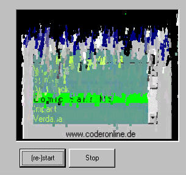

## GOTO\!\!\! this code makes any picture melt away \!\!\!

### Description

Put anything you wanna melt inside my picture box and watch the effect.. With this code you can easyly create a melting-screen-save! So: Try it out!
 
### More Info
 

             |
---                |---
**Submitted On**   |2000-06-20 13:06:22
**By**             |[Max Christian Pohle](https://github.com/Planet-Source-Code/PSCIndex/blob/master/ByAuthor/max-christian-pohle.md)
**Level**          |Beginner
**User Rating**    |5.0 (20 globes from 4 users)
**Compatibility**  |VB 4\.0 \(16\-bit\), VB 4\.0 \(32\-bit\), VB 5\.0, VB 6\.0
**Category**       |[Custom Controls/ Forms/  Menus](https://github.com/Planet-Source-Code/PSCIndex/blob/master/ByCategory/custom-controls-forms-menus__1-4.md)
**World**          |[Visual Basic](https://github.com/Planet-Source-Code/PSCIndex/blob/master/ByWorld/visual-basic.md)
**Archive File**   |[CODE\_UPLOAD69226202000\.zip](https://github.com/Planet-Source-Code/max-christian-pohle-goto-this-code-makes-any-picture-melt-away__1-8520/archive/master.zip)

